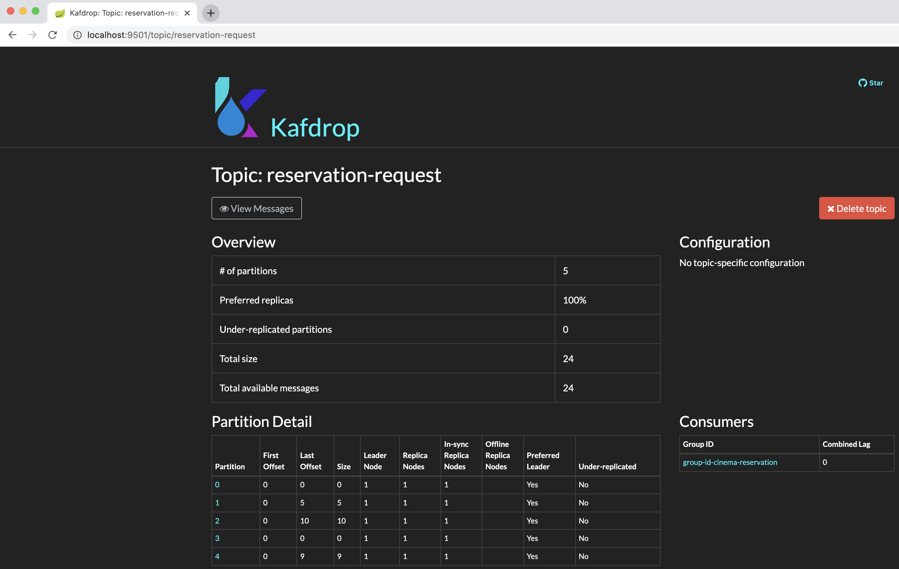

### Reservation Demo

Showcase for reservation 

#### Prerequisites for build

- mvn
- jdk11
- docker & docker-compose

#### Stack
    spring boot, kafka , liquibase, testcontainer, docker compose
    
#### Build
```
~/build.sh
```
Two images will be pushed to docker registry

#### Deploy

```
~/deploy.sh
```
Deployed containers can be seen with using 
```
~/ docker ps
```

### Endpoints
- Reservation from starting 
```
http://${domain}:8080/reservation/{personName}/{requestedSession}
```
- personName : the name of requested person
- requestedSession : session id, any string can be given. for the mock porpuse service will get hash to choose predefined sessions. 


####  undeploy
```
~/undeploy.sh
```
### Scaling
Scaling is done using kafka. Each request is sent as a kafka topic with the theater/room session id. Simultaneous requests for different hall/theater sessions will be sent to different departments in order of partitioning.


### Scaling
Simultaneous requests for the same hall/theater sessions will be sent to same partition in order and one consumer group is used to consume topics. Thus, one service will handle one critical section and we are able solve transaction problem for reservation.
 
### Kafka Topics
Kafka drop is used to view topics. 
 ```
http://${domain}:9501/
```


### Running Tests
 - unit test : 
    ```
   ~/mvn test
   ``` 
 - integration test : 
    ```
   ~/mvn clean verify -Pfailsafe
   ``` 
